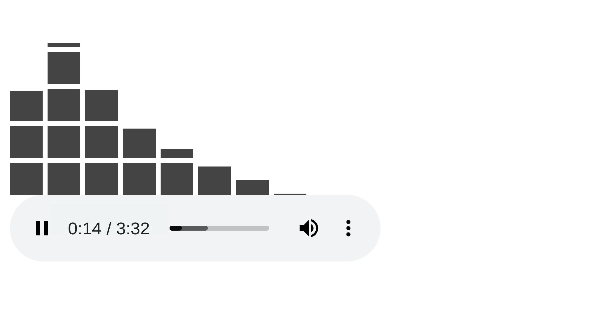

# Audio Visualizer - Frequency Spectrum Bars

A demo app based on [Web Audio API](https://developer.mozilla.org/en-US/docs/Web/API/Web_Audio_API)
to show frequency data of playing audio in real time in bars.

## Setup:
1. Place any audio file in the root of this project
2. Refer to the file in the `<audio>` tag used in index.html
3. Launch index.html (preferably through a server)

(Uses Vue JS loaded via CDN)